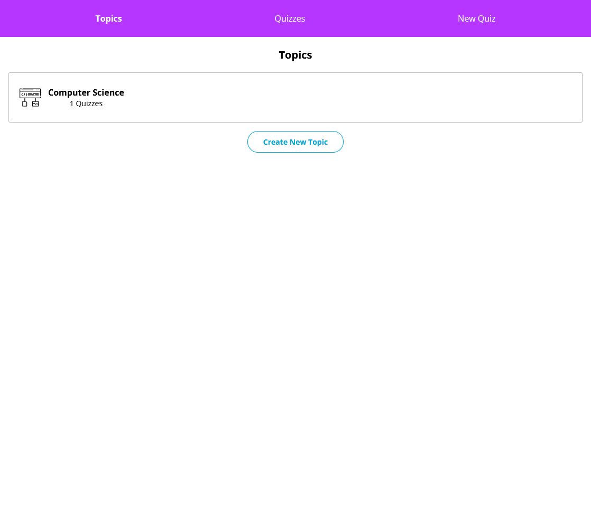

# Flash Cards

This is a Flash Card Style Quiz App Built in React, and is part a practice project from Codecademy's Full Stack Engineer Course. 
Users will be able to create their own topics, quizzes for those topics, and flashcards for those quizzes. 
Users will also be able to interact with their quizzes by flipping flashcards over.

## Table of contents

- [Overview](#overview)
  - [Screenshot](#screenshot)
  - [Links](#links)
- [My process](#my-process)
  - [Built with](#built-with)
  - [What I learned](#what-i-learned)
  - [Continued development](#continued-development)
  - [Useful resources](#useful-resources)
- [Author](#author)

## Overview

### Screenshot

## My process

### Built with

- Semantic HTML5 markup
- CSS custom properties
- Flexbox
- CSS Grid
- Responsive Design
- [React](https://reactjs.org/) - JS library
- [Redux](https://redux.js.org/) - State Container for JS
- [React Router](https://reactrouter.com/) - Library for routing in React
- [Create React App](https://github.com/facebook/create-react-app) - Create React App

### What I learned

 Practiced using Redux and Redux Toolkit to manage the complex state of a flashcard-style quiz app. 
